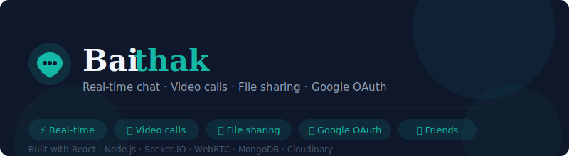

# Baithak Chat App



[](https://YOUR_NETLIFY_URL_HERE)
[](https://github.com/A1tharva/baithak)


> A full-stack real-time chat application with peer-to-peer video calling, file sharing, and Google OAuth — built with React, Node.js, Socket.IO, and WebRTC.

---

## 🚀 Live Demo

🔗 **[https://YOUR_NETLIFY_URL_HERE](https://YOUR_NETLIFY_URL_HERE)** ← _Replace with your Netlify URL after deployment_

---

## ✨ Features

- 💬 **Real-time messaging** — instant chat powered by Socket.IO
- 📹 **Peer-to-peer video & audio calling** — WebRTC with no third-party relay
- 🖼️ **File & image sharing** — upload and share via Cloudinary
- 🔐 **Google OAuth 2.0** — sign in with Google or use email/password
- 👥 **Friend request system** — mutual acceptance required before chatting
- 🔇 **Mute notifications** — per-chat mute with unread badge still visible
- 🎤 **Voice-to-text input** — dictate messages using Web Speech API
- ✂️ **Profile picture cropping** — upload and crop your avatar
- 📱 **Mobile responsive** — works on phones and tablets
- 🌙 **Dark mode UI** — clean dark theme throughout

---

## 🛠️ Tech Stack

| Layer | Technology |
|---|---|
| Frontend | React 18, Vite, TailwindCSS |
| Backend | Node.js, Express |
| Realtime | Socket.IO |
| Video Calling | WebRTC |
| Database | MongoDB Atlas |
| Auth | JWT, Google OAuth 2.0 (Passport.js) |
| File Storage | Cloudinary |
| Deployment | Netlify (frontend), Render (backend) |

---

## 📁 Project Structure

```
baithak/
├── client/                 # React frontend
│   ├── src/
│   │   ├── components/     # UI components
│   │   ├── pages/          # Login, Register, Chat
│   │   ├── context/        # Auth, Socket, WebRTC, Mute
│   │   ├── hooks/          # useWebRTC, useSpeechRecognition, etc.
│   │   └── api/            # Axios API calls
│   └── vite.config.js
└── server/                 # Node.js backend
    ├── controllers/        # Route handlers
    ├── models/             # Mongoose schemas
    ├── routes/             # Express routes
    ├── socket/             # Socket.IO logic
    └── config/             # Passport, Cloudinary config
```

---

## ⚙️ Local Setup

### Prerequisites
- Node.js 18+
- MongoDB Atlas account
- Cloudinary account
- Google OAuth credentials

### 1. Clone the repo

```bash
git clone https://github.com/A1tharva/baithak.git
cd baithak
```

### 2. Setup Backend

```bash
cd server
cp .env.example .env
# Fill in your values in .env
npm install
npm run dev
```

### 3. Setup Frontend

```bash
cd client
cp .env.example .env
# Fill in your values in .env
npm install
npm run dev
```

### 4. Environment Variables

**server/.env**
```env
PORT=5001
MONGO_URI=mongodb+srv://<username>:<password>@cluster.mongodb.net/baithak
JWT_SECRET=your_jwt_secret
CLIENT_URL=http://localhost:5173
NODE_ENV=development
GOOGLE_CLIENT_ID=your_google_client_id
GOOGLE_CLIENT_SECRET=your_google_client_secret
GOOGLE_CALLBACK_URL=http://localhost:5001/api/auth/google/callback
CLOUDINARY_CLOUD_NAME=your_cloud_name
CLOUDINARY_API_KEY=your_api_key
CLOUDINARY_API_SECRET=your_api_secret
```

**client/.env**
```env
VITE_API_URL=http://localhost:5001
VITE_SOCKET_URL=http://localhost:5001
```

---

## 🚢 Deployment

- **Backend** → [Render](https://render.com) (uses `server/render.yaml`)
- **Frontend** → [Netlify](https://netlify.com) (uses `client/vercel.json`)

---

## 📄 License

MIT © [A1tharva](https://github.com/A1tharva)
